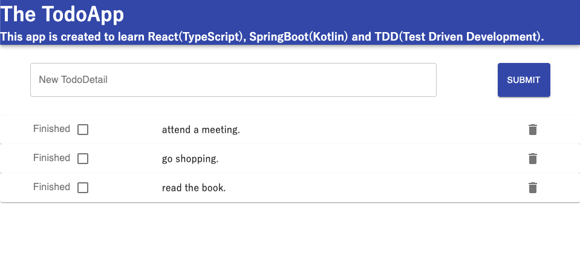

# The TodoApp

This is the Sample Application for developers wants to develop a FullStack Application. 

# Documents
- [Front-end application](./client/README.md)
- [Back-end application](./server/README.md)
- [End-to-end Test](./e2e/README.md)